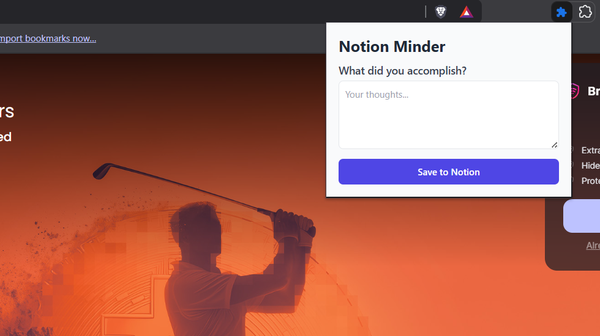

# Notion Minder Extension

A simple, offline-first browser extension to help you stay mindful and journal your thoughts directly to a Notion database. It provides context-aware reminders when you're on user-defined "shallow work" websites, prompting you for a quick reflection.



## ✨ Features

-   **Context-Aware Reminders**: Triggers a browser notification after you spend a set amount of time on websites you've listed (e.g., social media, news sites).
-   **Direct to Notion**: Saves your journal entries to a specified Notion database with a single click.
-   **Offline First & Private**: No external servers, accounts, or tracking. All your settings, including your Notion API key, are stored locally on your computer's browser storage.
-   **Customizable**: Easily configure your Notion integration details and the list of websites that trigger reminders through a simple options page.

---

## 🛠️ Tech Stack

-   **Framework**: React.js
-   **Build Tool**: Vite
-   **Styling**: Tailwind CSS
-   **Platform**: Chrome Extension Manifest V3

---

## 🚀 Setup and Installation

To set up and run this project locally, follow these steps:

### 1. Clone the Repository
```bash
git clone https://github.com/23f2002284/AIA.git
cd AIA
cd notion-minder-extension
```

### 2\. Install Dependencies

```bash
npm install
```

### 3\. Build the Extension

This command bundles the project into the `dist` folder.

```bash
npm run build
```

### 4\. Load the Extension in Your Browser

1.  Open your browser (Chrome, Edge, etc.) and navigate to `chrome://extensions`.
2.  Enable **Developer mode** using the toggle switch in the top-right corner.
3.  Click the **Load unpacked** button.
4.  Select the `dist` folder from the project directory.

The Notion Minder icon should now appear in your browser's toolbar.

-----

## ⚙️ Configuration

Before you can use the extension, you need to configure it to connect to your Notion workspace.

1.  **Get Your Notion API Key**:

      - Go to [notion.so/my-integrations](https://www.notion.so/my-integrations).
      - Create a new integration and copy the "Internal Integration Secret" key.

2.  **Get Your Notion Database ID**:

      - Create a new Database in Notion for your journal entries.
      - Click the **"..."** menu on your new database and **"Add connection"**, selecting the integration you just created.
      - Go to the database page in your browser. The URL will look like `notion.so/your-workspace/xxxxxxxxxxxxxxxxxxxxxxxxxxxxxxxx?v=...`.
      - The **Database ID** is the 32-character part of the URL before the `?`.

3.  **Configure the Extension**:

      - Right-click the Notion Minder extension icon in your toolbar and select **Options**.
      - Paste your **Notion API Key** and **Journal Database ID** into the respective fields.
      - Add any websites you want to trigger reminders under the **Shallow Work Sites** section (one per line).
      - Click **Save Settings**.

You are now ready to use the extension\!

-----

### 🔒 A Note on Security

This extension is designed to be private and offline-first. Your Notion API key is stored **only** in your browser's local, sandboxed storage (`chrome.storage.local`). It is never transmitted to any server other than Notion's official API when you save an entry.

This is a too early version of the extension. I will be updating it soon with more features and a better user interface.